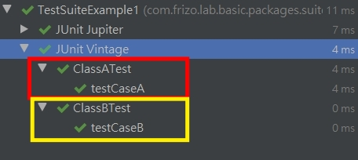
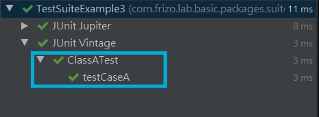

# 以 Suite 成套驅動專案內大量測試

<br>

---

<br>

## 加入依賴

<br>
<br>
<br>
<br>

## 建立測試類別

<br>

先建立幾個需要被篩選出來執行的測試測試類：

<br>

src/test/java/*/packages/packageA/ClassATest.java

```java
public class ClassATest {
    @Tag("production")
    @Test
    @DisplayName("packageA > ClassATest")
    public void testCaseA(){}
}
```

<br>

src/test/java/*/packages/packageB/ClassBTest.java

```java
public class ClassBTest {
    @Tag("development")
    @Test
    @DisplayName("packageB > ClassBTest")
    public void testCaseB(){}
}
```

<br>

src/test/java/*/packages/packageC/ClassCTest.java

```java
public class ClassCTest {
    @Test
    @DisplayName("packageC > ClassCTest")
    public void testCaseC(){}
}
```
<br>

`@Tag` 標籤可以作為測試挑選條件。

<br>
<br>
<br>
<br>

## 建立成套測試組合

<br>

### 使用 `@SelectPackages`

<br>

`@RunWith(JunitPlatform.class)` 主要是讓不支援 JUnit 5 的打包工具與 IDE 可以使用 JUnit 4 正常執行成套測試類別。

<br>

以 `@SelectPackages` 選擇套件 packageA 與套件 packageB：

<br>

src/test/java/*/packages/suiteTest/TestSuiteExample1.java

```java
@RunWith(JUnitPlatform.class)
@SelectPackages({"com.frizo.lab.basic.packages.packageA", "com.frizo.lab.basic.packages.packageB"})
public class TestSuiteExample1 {}
```

<br>

看執行結果：

<br>



<br>
 
可以看到 __TestSuiteExample1__ 確實依照 `@SelectPackages` 選取的內容進行成套測試。

<br>
<br>
<br>
<br>

### 使用 @SelectClasses

<br>

以 `@SelectClasses` 選擇類別 ClassATest 與 ClassBTest：

<br>

src/test/java/*/packages/suiteTest/TestSuiteExample2.java

```java
@RunWith(JUnitPlatform.class)
@SelectClasses({ClassATest.class, ClassBTest.class})
public class TestSuiteExample2 {}
```

<br>

執行結果跟 TestSuiteExample1 一樣。

<br>
<br>
<br>
<br>

### 使用 @SelectPackages 搭配 @IncludePackages

<br>

`@SelectPackages` 選擇了套件 `com.frizo.lab.basic.packages`，則所有子套件如：

* com.frizo.lab.basic.packages.packageA

* com.frizo.lab.basic.packages.packageB

* com.frizo.lab.basic.packages.packageC

都被包含在內。

<br>

`@IncludePackages` 約束套件只有 `com.frizo.lab.basic.packages.packageA`。

<br>


src/test/java/*/packages/suiteTest/TestSuiteExample3.java
```java
@RunWith(JUnitPlatform.class)
@SelectPackages("com.frizo.lab.basic.packages")
@IncludePackages("com.frizo.lab.basic.packages.packageA")
public class TestSuiteExample3 {}
```

<br>

執行結果如下：

<br>



<br>

確實只有 packageA 中的 ClassATest 被執行測試。

<br>
<br>
<br>
<br>

### 使用 @SelectPackages 搭配 @ExcludePackages

<br>

`@ExcludePackages` 排除套件 packageA，只測試 __ClassBTest__ 與 __ClassATest__。

<br>

src/test/java/*/packages/suiteTest/TestSuiteExample4.java
```java
@RunWith(JUnitPlatform.class)
@SelectPackages("com.frizo.lab.basic.packages")
@ExcludePackages("com.frizo.lab.basic.packages.packageA")
public class TestSuiteExample4 {}
```

<br>
<br>
<br>
<br>

### 使用 @SelectPackages 搭配 @IncludeClassNamePatterns

<br>

`@IncludeClassNamePatterns` 約束類別名稱必須含有 "ATest" 結尾字串。

<br>

src/test/java/*/packages/suiteTest/TestSuiteExample5.java
```java
@RunWith(JUnitPlatform.class)
@SelectPackages("com.frizo.lab.basic.packages")
@IncludeClassNamePatterns({".*ATest"})
public class TestSuiteExample5 {}
```

<br>
<br>
<br>
<br>

### 使用 @SelectPackages 搭配 @ExcludeClassNamePatterns

<br>

`@ExcludeClassNamePatterns` 排除類別名稱含有 "ATest" 結尾字串的類別。

<br>

src/test/java/*/packages/suiteTest/TestSuiteExample6.java
```java
@RunWith(JUnitPlatform.class)
@SelectPackages("com.frizo.lab.basic.packages")
@ExcludeClassNamePatterns({".*ATest"})
public class TestSuiteExample6 {}
```

<br>
<br>
<br>
<br>

### 使用 @SelectPackages 搭配 @IncludeTags

<br>

`@IncludeTags` 可以指定測試備標註 Tag 的方法。

<br>

src/test/java/*/packages/suiteTest/TestSuiteExample7.java
```java
@RunWith(JUnitPlatform.class)
@SelectPackages("com.frizo.lab.basic.packages")
@IncludeTags("production")
public class TestSuiteExample7 {}
```

<br>
<br>
<br>
<br>

### 使用 @SelectPackages 搭配 @ExcludeTags

<br>

`@ExcludeTags` 可以排除測試備標註 Tag 的方法。

<br>

src/test/java/*/packages/suiteTest/TestSuiteExample8.java
```java
@RunWith(JUnitPlatform.class)
@SelectPackages("com.frizo.lab.basic.packages")
@ExcludeTags("development")
public class TestSuiteExample8 {}
```

<br>
